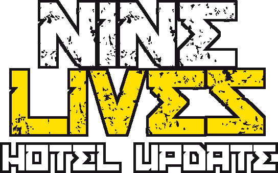

<h1></h1>

This is a place for archives and pre-patched builds

 

	

<h3>Used libaries</h3>

<table align="center">
    <tr>
    </tr>
    <tr>
        <td align="right"></td>
        <td><a href="https://github.com/JujuAdams/scribble">Scribble Deluxe</a> Powerful, fully featured text renderer</td>
	<td align="right"></td>
        <td><a href="https://github.com/offalynne/input">Input</a> 🖍 Comprehensive cross-platform input</td>
    </tr>
</table>

> [!IMPORTANT]
> This is not the Nine Lives source code!

> [!NOTE]
> Meow

